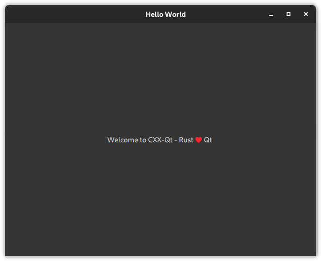

# Tooling check

## Setup check

✅ Fully restart your terminal (not just open a fresh tab).

✅ Let's check that you have installed Rust.

```console
$ rustc --version
rustc 1.73.0 (cc66ad468 2023-10-03)
```

```console
$ cargo --version
cargo 1.73.0 (9c4383fb5 2023-08-26)
```

✅ In a work directory, run:

```console
$ cargo new --bin hello-world
$ cd hello-world
$ cargo run --release
   Compiling hello-world v0.1.0 (C:\Code\ferrous\hello-world)
    Finished release [optimized] target(s) in 0.99s
     Running `target\release\hello-world.exe`
Hello, world!
```

This ensures that the whole toolchain works correctly and finds the system linker. This should work at all times, if it doesn't, immediately ask for a trainer.

# Qt specifics

For those interested in following the Qt section of the course,
the Rust toolchain must be able to find the Qt installation.

The Rust-Qt bindings ([CXX-Qt](https://github.com/kdab/cxx-qt)) need to be able to find your Qt installation.
For this it relies on the `qmake` executable.
CXX-Qt will try to find qmake in your path.

✅ Confirm that qmake reports a version of Qt 6
```console
$ qmake --version
QMake version 3.1
Using Qt version 6.5.1 in /usr/lib64
```

> If for some reason you do not want to add `qmake` to your path, you can use the `QMAKE` environment variable
> to tell CXX-Qt where to find the Qt6 qmake executable.
> e.g.:
> ```console
> QMAKE=/usr/bin/qmake6 cargo run
> ```

## Hello world with Qt
To test that the Rust toolchain can indeed find and link to your Qt installation, you can clone the training
repository and run the `qt-hello-world` example crate.

**✅ Clone the repository**
```console
$ git clone https://github.com/ferrous-systems/qt-training-2023
```

**✅ Navigate to the qt-hello-world crate**
```console
$ cd qt-training-2023/crates/qt-hello-world/
```

**✅ Test that it works**
```console
$ cargo run
```
If you don't have `qmake` in your PATH, use:
```console
$ QMAKE=/path/to/your/qmake cargo run
```

The resulting application should look like this:


