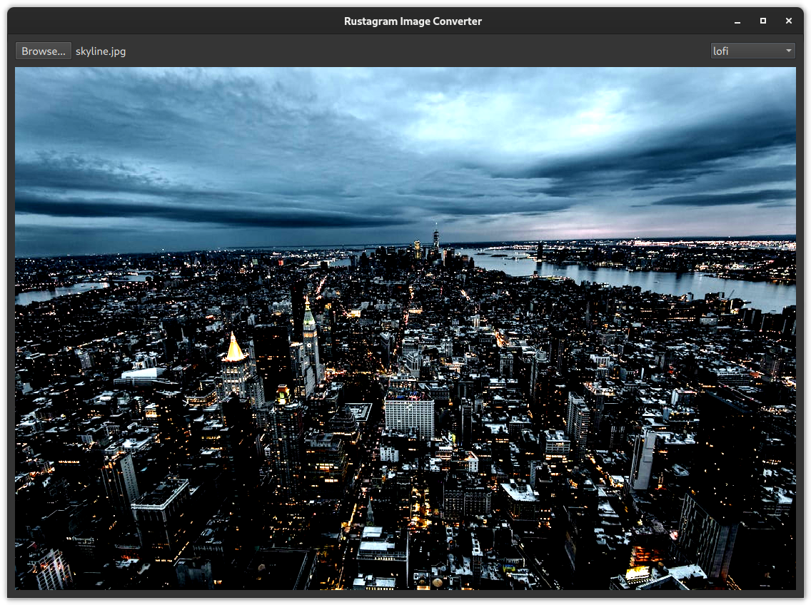

# Adding behavior in Rust

At the moment our ImagePainter doesn't do anything, not even paint an image.

So let's add some behavior.
We want our ImagePainter to load a file from a given path, display a status for errors, etc.

✅ First, add the necessary fields to the `ImagePainterRust` struct
* ✅ The image path to load from
* ✅ Current status
* ✅ The converted image
* ✅ A boolean to indicate whether the conversion is currently running
* ✅ The filter to use for conversion

✅ Then make sure to initialize the values to sensible definitions by adding a custom implementation of the [`Default` trait](https://doc.rust-lang.org/std/default/trait.Default.html).

✅ And don't forget to import the new types with `use`.

<details>
<summary>Example definition</summary>

```rust
use cxx_qt_lib::{QColor, QImage, QString, QUrl};

pub struct ImagePainterRust {
    filter: QString,
    status: QString,
    running: bool,
    file_url: QUrl,

    image: Option<QImage>,
}

impl Default for ImagePainterRust {
    fn default() -> Self {
        Self {
            filter: QString::from("1977"),
            status: QString::from("No file selected"),
            image: None,
            file_url: QUrl::default(),
            running: false,
        }
    }
}
```
</details>

Now that we've added members to the Rust side, let's expose them as `Q_PROPERTY`s.
To do so, add `#[qproperty([TYPE], [FIELD_NAME])]` attributes to the `#[qobject]` type declaration for every property.

Note that the image itself won't be a property as QML unfortunately can't easily render `QImage` instances.
We'll use the `QPainter` for this.

✅ Add properties for `status`, `filter`, `running` and `file_url`.

✅ Add the imports for the necessary types (`QString`, `QUrl`) to the `#[cxx_qt::bridge]`.

<details>
<summary>Example definition</summary>

```rust
#[cxx_qt::bridge(cxx_file_stem = "image_painter")]
pub mod qobject {
    unsafe extern "C++" {
        include!("cxx-qt-lib/qcolor.h");
        type QColor = cxx_qt_lib::QColor;

        include!("cxx-qt-lib/qurl.h");
        type QUrl = cxx_qt_lib::QUrl;

        include!("cxx-qt-lib/qstring.h");
        type QString = cxx_qt_lib::QString;

        include!(<QtQuick/QQuickPaintedItem>);
    }

    // ...

    unsafe extern "RustQt" {
        #[qml_element]
        #[base = "QQuickPaintedItem"]
        #[qobject]
        #[qproperty(QString, status)]
        #[qproperty(QString, filter)]
        #[qproperty(QUrl, file_url)]
        #[qproperty(bool, running)]
        type ImagePainter = super::ImagePainterRust;

        // ...
    }

    // ...
}
```
</details>

✅ Check the new properties work by hooking them up to QML.

They don't do anything yet, but you also shouldn't get any errors from QML.

✅ Create a new function on our `ImagePainter` that will later get called whenever we need to update the image:
```rust
impl qobject::ImagePainter {
    fn load_file(mut self: Pin<&mut Self>) {
        println!("Hello world from CXX-Qt");
    }
}
```

✅ Hook up the function so it is called whenever the filter or the file path change
```rust
impl cxx_qt::Initialize for qobject::ImagePainter {
    fn initialize(mut self: Pin<&mut Self>) {
        self.as_mut().set_fill_color(&QColor::from_rgb(0, 119, 200));

        self.as_mut().on_filter_changed(Self::load_file).release();

        self.as_mut().on_file_url_changed(Self::load_file).release();
    }
}
```
> Try finding explanations for these answers in the [CXX-Qt book][CXX-Qt book].
>
> ❓ Why is the `release()` call necessary after connecting to a signal?\
> ❓ How can you change the [connection type](https://doc.qt.io/qt-6/qt.html#ConnectionType-enum) when connecting to a signal from Rust?

✅ Check that you can successfully print "Hello world from CXX-Qt!" by selecting a file path or changing the image filter

Before we implement the image loading and filtering, we'll need some additional types:
* QByteArray (and the QByteArrayCursor helper)
* QSizeF and QRectF to calculate the size for painting

✅ Import these types from cxx-qt-lib

✅ Add QSizeF and QRectF to the `#[cxx_qt::bridge]`

We'll also need a few more functions from C++ to paint the image, get the size of the ImagePainter, etc.

✅ Add declarations for the following functions to the `#[cxx_qt::bridge]`
* ✅ [QPainter::drawImage](https://doc.qt.io/qt-5/qpainter.html#drawImage-4)
* ✅ [QQuickPaintedItem::size][QQuickPaintedItem]
* ✅ [QQuickPaintedItem::update][QQuickPaintedItem]

✅ Tell CXX-Qt to enable threading support by means of the `cxx_qt::Threading` trait

<details>
<summary> Example declarations </summary>

```rust
#[cxx_qt::bridge(cxx_file_stem = "image_painter")]
mod qobject {
    // ...

    unsafe extern "C++" {
        include!(<QtGui/QPainter>);
        type QPainter;

        #[rust_name = "draw_image"]
        fn drawImage(self: Pin<&mut QPainter>, rectangle: &QRectF, image: &QImage);
    }

    unsafe extern "RustQt" {
        // ...

        #[inherit]
        fn size(self: &ImagePainter) -> QSizeF;

        #[inherit]
        fn update(self: Pin<&mut ImagePainter>);
    }

    impl cxx_qt::Threading for ImagePainter {}
    // ...
}
```
</details>

✅ Add code to load the selected image from disk and display it in the `update` function

Documentation that may be useful:
* [CXX-Qt-lib](https://docs.rs/cxx-qt-lib/latest/cxx_qt_lib/) for using Qt types from Rust
* [rustagram2](https://docs.rs/rustagram2/latest/rustagram/)
    * Click on the Re-export of the `image` crate to learn more about how to use the resulting image.
* [Rust standard library documentation](https://doc.rust-lang.org/std/index.html)

✅ Add threading in Rust via [`std::thread::spawn`](https://doc.rust-lang.org/std/thread/fn.spawn.html) to load and convert the image in the background
* Check out the [CXX-Qt book][CXX-Qt book] to learn more about Threading

✅ Add a `BusyIndicator` to QML to show that the background thread is wthat the background thread is waiting.

The resulting application should look like this:



✅ Check out the [full example code](https://github.com/ferrous-systems/qt-training-2023/tree/main/crates/with-workspace/) and compare it with your implementation

[QQuickPaintedItem]: https://doc.qt.io/qt-6/qquickpainteditem-members.html
[CXX-Qt book]: https://docs.rs/cxx-qt-lib/latest/cxx_qt_lib/
